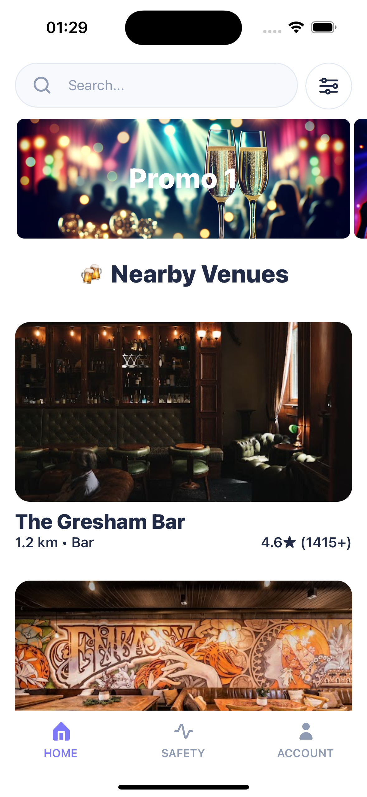
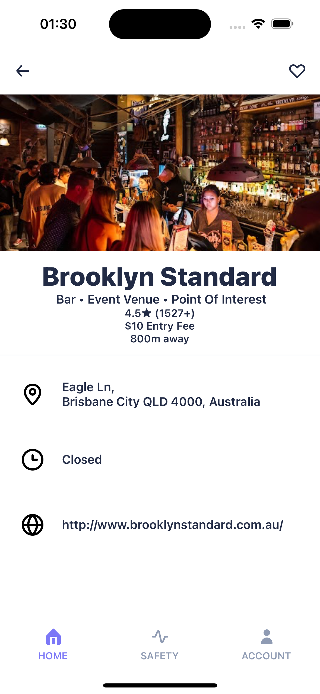
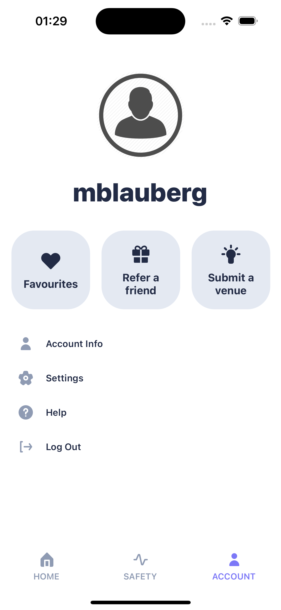
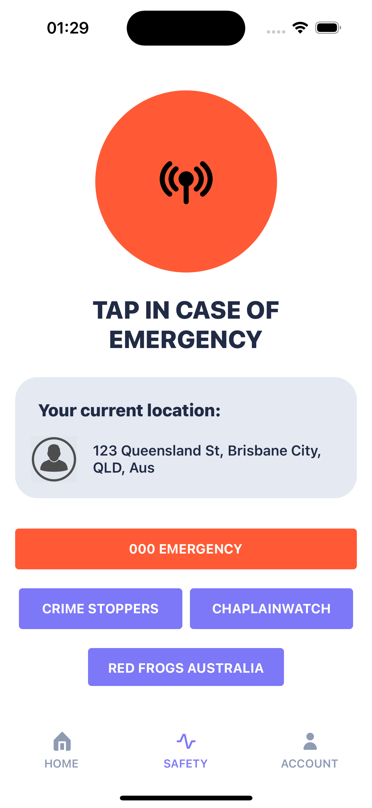
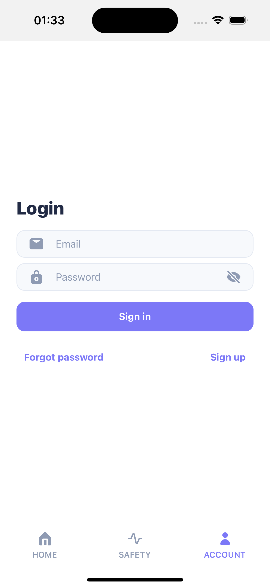

# 🍻 Clinks - Nightlife Venue Discovery App

<div align="center">


[](https://reactnative.dev/)
[](https://expo.dev/)
[](https://firebase.google.com/)
[](https://akveo.github.io/react-native-ui-kitten/)
[](#)

**A sophisticated React Native application for discovering and exploring nightlife venues**

[Features](#-features) • [Screenshots](#-screenshots) • [Architecture](#-technical-architecture) • [Installation](#-installation) • [Demo](#-live-demo)

</div>

---

## 🎯 **Project Overview**

Clinks is a React Native application that revolutionises nightlife discovery by connecting users with nearby venues through real-time location services and comprehensive venue data. Built with modern mobile development practices, it demonstrates expertise in React Native, Firebase integration, Google APIs, and advanced mobile UI/UX design.

### **🏆 Key Achievements**
- ✅ **Development-Complete App** - Core functionality with real API integrations
- ✅ **Advanced React Native** - Custom hooks, context management, and performance optimisation
- ✅ **Real-Time Location Services** - GPS integration with proper permissions handling
- ✅ **External API Integration** - Google Places API with comprehensive error handling
- ✅ **Firebase Backend** - Authentication, Firestore database, and security rules
- ✅ **Professional UI/UX** - Custom theming, responsive design, and accessibility

---

## 📱 **Screenshots**

<div align="center">

### **Home Screen - Venue Discovery**


*Real-time venue discovery with location-based filtering and promotional content*

### **Venue Details - Comprehensive Information**


*Detailed venue information with Google Places API integration*

### **Account Management - User Experience**


*Firebase authentication with profile management and navigation*

### **Safety Features - Emergency Resources**


*Emergency contacts and safety resources for nightlife safety*

### **Authentication Flow**


*Secure authentication with Firebase and form validation*

</div>

---

## ✨ **Core Features**

### 🎯 **Smart Venue Discovery**
- **Real-time location services** with GPS integration and permission handling
- **Google Places API integration** for comprehensive venue data
- **Intelligent filtering** by operational status, ratings, and business hours
- **Dynamic sorting** prioritising currently open venues
- **Pull-to-refresh** functionality for real-time updates

### 🔐 **Robust Authentication System**
- **Firebase Authentication** with email/password login
- **Persistent session management** using AsyncStorage
- **Secure user data handling** with Firestore integration
- **Automatic fallback** for missing user profiles
- **Proper error handling** and user feedback

### 🎨 **Modern UI/UX Design**
- **Eva Design System** integration with custom theming
- **Theme foundation** with basic light/dark theme structure prepared
- **Responsive design** optimised for iOS and Android
- **Safe area handling** for iPhone X+ home indicators
- **Accessibility features** and proper navigation patterns

### 🚀 **Performance & Architecture**
- **Custom React hooks** for efficient data management
- **Memory leak prevention** with proper cleanup functions
- **Error boundaries** and comprehensive error handling
- **Optimized image loading** with caching and fallbacks
- **Component-based architecture** with clear separation of concerns

---

## 🏗️ **Technical Architecture**

### **Frontend Stack**
```
React Native 0.72.10
├── Navigation: React Navigation 6.x (Stack & Tab)
├── UI Framework: UI Kitten + Eva Design System  
├── State Management: React Hooks + Context API
├── Location Services: Expo Location with permissions
├── Image Handling: Optimized loading with fallbacks
└── Development: Expo SDK 49 with modern tooling
```

### **Backend & Services**
```
Firebase Suite
├── Authentication: Firebase Auth v10 with persistence
├── Database: Firestore NoSQL with security rules
├── Storage: AsyncStorage for offline functionality
└── Configuration: Environment-based setup
```

### **External APIs**
```
Google Cloud Platform
├── Places API: Venue discovery and details
├── Places Photos API: High-quality venue images  
├── Location Services: GPS and geolocation
```

### **Development Tools**
```
Code Quality & Standards
├── Scripts: Basic lint and format commands
├── Documentation: Comments in key files
├── JSDoc: Documentation in core components
├── Git: Version control with meaningful commits
└── Expo CLI: Development and deployment tools
```

---

## 📁 **Project Structure**

```
clinks/
├── src/
│   ├── components/              # Reusable UI components
│   │   ├── VenueCard.js        # Venue display with navigation
│   │   ├── SearchBar.js        # Search with filter functionality
│   │   ├── PromoPager.js       # Promotional content carousel
│   │   ├── SquareButton.js     # Custom styled buttons
│   │   ├── BackAction.js       # Navigation back button
│   │   └── HeartAction.js      # Favorite toggle component
│   ├── screens/                # Application screens
│   │   ├── HomeScreen.js       # Main venue discovery
│   │   ├── VenueScreen.js      # Detailed venue information
│   │   ├── AccountScreen.js    # User profile management
│   │   ├── SafetyScreen.js     # Emergency resources
│   │   ├── LoginScreen.js      # Authentication flow
│   │   └── [7 additional screens: SignupScreen, FavouritesScreen, ReferScreen, SubmitScreen, AccountInfoScreen, SettingsScreen, HelpScreen]
│   ├── hooks/                  # Custom React hooks
│   │   ├── useFetchNearby.js   # Venue fetching with cleanup
│   │   └── useFetchDetails.js  # Venue details fetching
│   ├── services/               # External service integrations
│   │   ├── Firebase.js         # Firebase configuration
│   │   └── Location.js         # Google Places API client
│   ├── utils/                  # Utility functions
│   │   ├── stringUtils.js      # String manipulation helpers
│   │   └── timeUtils.js        # Time/date formatting
│   ├── Navigator.js            # Navigation configuration
│   ├── theme-context.js        # Theme management
│   └── theme.json              # Custom colour palette
├── assets/                     # Static resources
├── screenshots/                # App screenshots for documentation
├── ios/                        # iOS native project files
├── .env.example               # Environment variables template
├── app.json                   # Expo configuration
└── package.json               # Dependencies and scripts
```

---

## 🚀 **Installation & Setup**

### **Prerequisites**
- Node.js 16+ and npm/yarn
- Expo CLI (`npm install -g expo-cli`)
- iOS Simulator (Xcode) or Android Emulator
- Firebase project with authentication enabled
- Google Cloud project with Places API enabled

### **Quick Start**

1. **Clone and Install**
   ```bash
   git clone https://github.com/mblauberg/clinks.git
   cd clinks
   npm install
   ```

2. **Environment Configuration**
   ```bash
   cp .env.example .env
   # Add your API keys to .env file:
   # EXPO_PUBLIC_FIREBASE_API_KEY=your_firebase_key
   # EXPO_PUBLIC_GOOGLE_API_KEY=your_google_places_key
   ```

3. **Firebase Setup**
   - Create Firebase project at [console.firebase.google.com](https://console.firebase.google.com)
   - Enable Authentication (Email/Password)
   - Create Firestore database
   - Update security rules:
   ```javascript
   rules_version = '2';
   service cloud.firestore {
     match /databases/{database}/documents {
       match /users/{userId} {
         allow read, write: if request.auth != null && request.auth.uid == userId;
       }
     }
   }
   ```

4. **Google Places API Setup**
   - Enable Places API in [Google Cloud Console](https://console.cloud.google.com)
   - Create API key with Places API restrictions
   - Enable billing for API usage

5. **Run the Application**
   ```bash
   npm start          # Start Expo development server
   npm run ios        # Run on iOS Simulator  
   npm run android    # Run on Android Emulator
   ```

---

## 🎬 **Live Demo**

### **Real-World Functionality**
- **Location Detection**: App requests permissions and detects user location
- **API Integration**: Fetches real venue data from Google Places
- **Authentication**: Create account and login with Firebase
- **Navigation**: Seamless transitions between screens
- **Error Handling**: Graceful handling of network and permission issues

### **Getting Started**
Create a new account through the signup screen or use your own test credentials in Firebase Authentication.

---

## 🛠️ **Development Highlights**

### **Advanced React Native Patterns**

**Custom Hooks with Cleanup**
```javascript
const useFetchNearby = (refreshTrigger) => {
  const [venues, setVenues] = useState([]);
  const isMountedRef = useRef(true);
  
  useEffect(() => {
    // Prevent memory leaks with mounted ref
    // Request cancellation and timeout handling
    // Fallback filtering logic for better UX
  }, [refreshTrigger]);
  
  return { venues, errorMsg, isLoading };
};
```

**Safe Area Handling for Modern Devices**
```javascript
const BottomTabBar = ({ navigation, state }) => {
  const insets = useSafeAreaInsets();
  return (
    <View style={{ paddingBottom: insets.bottom }}>
      <BottomNavigation>
        {/* Tab content */}
      </BottomNavigation>
    </View>
  );
};
```

**Robust Error Handling**
```javascript
const handleApiCall = async () => {
  try {
    const response = await fetchNearbyPlaces(lat, lng);
    if (!response.ok) {
      throw new Error(`API Error: ${response.status}`);
    }
    // Success handling with fallback filtering
  } catch (error) {
    // Comprehensive error logging and user feedback
    setErrorMsg(`Network error: ${error.message}`);
  }
};
```

### **Firebase Integration Best Practices**

**Secure Authentication Flow**
```javascript
// Authentication with persistence
const auth = initializeAuth(app, {
  persistence: getReactNativePersistence(AsyncStorage),
});

// User data fetching with fallbacks
const getUserData = async (userId) => {
  try {
    const userData = await fetchUserData(userId);
    return userData || createDefaultUserProfile(auth.currentUser);
  } catch (error) {
    return createFallbackProfile(auth.currentUser);
  }
};
```

### **Performance Optimizations**

- **Memory Leak Prevention**: useRef for component mounted state
- **Request Cancellation**: AbortController for API calls
- **Efficient Filtering**: Multi-level fallback filtering logic
- **Image Optimization**: Lazy loading with placeholder fallbacks
- **Navigation Optimization**: Stack navigation with proper screen options

---

## 📊 **Technical Achievements**

### **Code Quality Metrics**
- ✅ **Functional Components** - Modern React hooks patterns
- ✅ **Basic Error Handling** - Error handling in API calls and authentication
- ✅ **Memory Management** - Cleanup patterns in custom hooks
- ✅ **Documentation** - JSDoc comments in core components
- ✅ **API Integration** - Google Places and Firebase services

### **Mobile Development Best Practices**
- ✅ **Platform-Specific Code** - iOS/Android optimisations
- ✅ **Safe Area Support** - Modern device compatibility
- ✅ **Permission Handling** - Proper location permission flow
- ✅ **Network Resilience** - Offline handling and error recovery
- ✅ **Accessibility** - Screen reader support and navigation

### **External Integration Complexity**
- ✅ **Google Places API** - Complex search and filtering logic
- ✅ **Firebase Services** - Authentication, Firestore, security rules
- ✅ **Location Services** - GPS, permissions, and error handling
- ✅ **Image Management** - Dynamic loading from Google Photos API
- ✅ **Real-time Updates** - Pull-to-refresh and state management

---

## 🔮 **Future Enhancements**

### **Planned Features**
- [ ] **Social Features** - Friend connections and venue check-ins
- [ ] **Advanced Filtering** - Price range, cuisine type, distance
- [ ] **Map Integration** - Interactive venue map with directions
- [ ] **Maps SDK Integration** - Google Maps or Apple Maps integration
- [ ] **Push Notifications** - Event alerts and friend activity
- [ ] **Offline Mode** - Cached venue data for offline viewing

### **Technical Improvements**
- [ ] **TypeScript Migration** - Enhanced type safety
- [ ] **Unit Testing** - Jest and React Native Testing Library  
- [ ] **CI/CD Pipeline** - Automated testing and deployment
- [ ] **Performance Monitoring** - Crash reporting and analytics
- [ ] **Advanced State Management** - Redux Toolkit or Zustand

---

## 🏆 **Skills Demonstrated**

### **Mobile Development**
- **React Native** - Advanced component patterns and hooks
- **Navigation** - Complex navigation flows with React Navigation
- **Platform APIs** - Location services, camera, permissions
- **Performance** - Memory management and optimisation techniques
- **Code Structure** - Organized component and screen architecture

### **Backend Integration**
- **Firebase** - Authentication, Firestore, security rules
- **REST APIs** - Google Places API integration
- **Error Handling** - Comprehensive error management
- **Security** - API key management and data protection
- **Real-time Data** - Live updates and synchronization

### **UI/UX Design**
- **Design Systems** - Eva Design System implementation
- **Responsive Design** - Multi-device compatibility
- **Accessibility** - Screen reader and navigation support
- **Animation** - Smooth transitions and loading states
- **Theming** - Dynamic theme switching and customization

### **Development Practices**
- **Git Workflow** - Feature branching and meaningful commits
- **Code Documentation** - JSDoc and inline documentation
- **Project Structure** - Scalable architecture and organisation
- **Environment Management** - Configuration and secrets handling
- **Debugging** - Advanced debugging and profiling techniques

---

## 📞 **Contact & Links**

**Michael Blauberg**  
📧 **Email**: [mblauberg.business@icloud.com](mailto:mblauberg.business@icloud.com)  
💼 **LinkedIn**: [linkedin.com/in/mblauberg](https://linkedin.com/in/michaelblauberg)  
🐙 **GitHub**: [github.com/mblauberg](https://github.com/michaelblauberg)  

---

## 📄 **Project Status**

### **✅ Completed Features**
- Full venue discovery and details functionality
- Firebase authentication and user management  
- Google Places API integration with error handling
- Professional UI with theming and responsive design
- Safe area handling for modern devices
- Comprehensive error handling and loading states

### **🎯 Project Goals Achieved**
- **Development-Complete**: Functional prototype demonstrating key features
- **Professional Quality**: Clean code, documentation, and architecture
- **Modern Practices**: Latest React Native patterns and best practices
- **Employer-Ready**: Demonstrates advanced mobile development skills

### **📝 Development Notes**
This project demonstrates React Native development capabilities including mobile app development, external API integration, Firebase backend services, and UI/UX design. The codebase showcases modern development patterns and could serve as a foundation for further development.

---

<div align="center">

*Last Updated: August 2025*

</div>